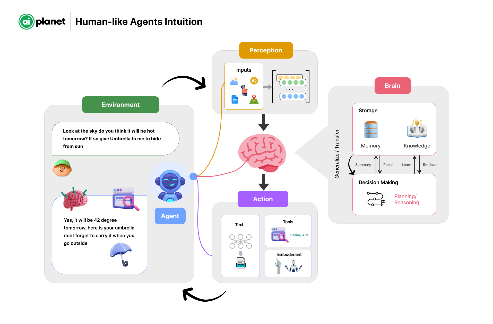

# Introduction

At AI Planet, we started OpenAGI to make human-like agents accessible to everyone, thereby paving the way towards open agents and, eventually, AGI for everyone. We strongly believe in the transformative power of AI and believe this initiative will go a long way in solving many real-life problems. In its current form, OpenAGI aims to provide a framework for developers to create autonomous human-like agents.

<figure><figcaption>
Simple illustration of how autonomous agents would operate just like humans
</figcaption></figure>

While the advancement of large language models (LLMs) led to numerous applications based on LLMs, at their core, these are adept at synthesizing and gathering information. On the other hand, agents demonstrate more autonomy; they engage in planning, reasoning, decision-making, and executing actions autonomously. The agents are just like humans, which will learn, improve, and become autonomous over time.

With OpenAGI, we aim to provide developers and organizations with the flexibility to build specialized agents that automate and solve complex problems. Agent use cases extend to various industries, they could include basic agents such as researching a topic, automating test cases, writing documentation for production code, and personalizing learning.

* **Education:** In education, agents can provide personalized learning experiences. They adapt and tailor learning content based on student's progress, performance and interests. It can extend to automating various other administrative tasks and assist teachers in improving their productivity.
* **Finance and Banking:** Financial services can use agents for fraud detection, risk assessment, personalized banking advice, automating trading, and customer service. They help in analyzing large volumes of transactions to identify suspicious activities and offer tailored investment advice.
* **Healthcare:** Agents can be deployed to monitor patients, provide personalized health recommendations, manage patient data, and automate administrative tasks. They can also assist in diagnosing diseases based on symptoms and medical history.

**The scope in the near future:**

We've been talking a lot about how these agents can get better by thinking about what they've done, learning from both humans and other peer agents via reflection of feedback, self-critics etc. This helps them improve and work more independently over time.

For example, we're thinking about tuning the platform in such a way that would enable developers to making agents that are really good at specific tasks over a period of time. For example: A specialized front-end developer with expertise in ReactJS. Just like human developers do, by working on many projects, these agents can learn and reuse what they've learned. They'll get better by thinking about their work, learning from feedback, and always trying to find the best solution.

Right now, we're just starting, and the agents can't remember things for a long time or plan ahead very well.  But these should get better soon. We're excited about the future and believe that our work will make open agents accessible for everyone, thereby solving meaningful real-life problems.

Below is a summary of the comparison between the capabilities of LLM apps and agents.

| Feature                  | LLM applications                                                         | Agents/Assistants                                                                                      |
| ------------------------ | ------------------------------------------------------------------------ | ------------------------------------------------------------------------------------------------------ |
| **Core Function**        | Aggregating and synthesizing information from existing data.             | Planning, reasoning, decision-making, and executing actions autonomously.                              |
| **Learning Method**      | Supervised and unsupervised learning from vast datasets.                 | Continual learning from new experiences and adapting over time without explicit retraining.            |
| **Decision Making**      | Limited to choosing responses based on probability and patterns in data. | Complex decision-making involving ethics, long-term planning, and unforeseen situations.               |
| **Autonomy**             | Operates within the scope defined by its programming and data.           | High degree of autonomy, capable of setting goals and pursuing them independently.                     |
| **Physical Interaction** | Generally, none, as it focuses on digital and informational tasks.       | Direct interaction with the physical world, including manipulation of objects and navigation in space. |

#### Features of OpenAGI

* **Flexible Agent Architecture**: OpenAGI features a flexible agent architecture, allowing users to easily create sequential, parallel, and dynamic communication patterns. This flexibility is designed to help users efficiently tackle their unique challenges.
* **Streamlined Integration and Configuration**: OpenAGI introduces simplified integration and configuration processes, eliminating the infinite loops commonly encountered in other tools.
* **Automated & Manual Agent Configuration Generation**: We provide the functionality to automatically generate the necessary configurations for building agents and their corresponding configurations. For developers preferring a hands-on approach, OpenAGI supports the manual configuration of agent solutions. This allows for detailed customization according to specific needs and preferences.

